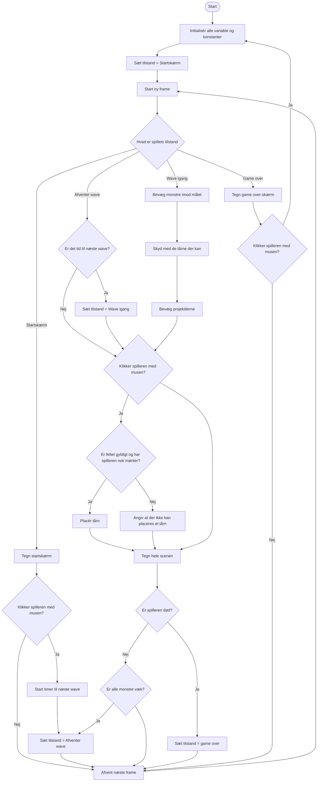

# MVP game loop

```mermaid
flowchart TD
    A@{ shape: stadium, label: Start} 
    --> init[Initialisér alle variable og konstanter]
    --> sætstartskærm[Sæt tilstand = Startskærm]
    --> nyframe[Start ny frame]
    --> tilstand{Hvad er spillets tilstand}
    tilstand -->|Startskærm| startskærm[Tegn startskærm] 
    startskærm --> klikstartskærm{Klikker spilleren med musen?}
    -->|Nej| afvent
    klikstartskærm -->|Ja| starttimer[Start timer til næste wave]
    --> sætspiligang

    afvent[Afvent næste frame] --> nyframe
    
    tilstand -->|Afventer wave| tidgået{Er det tid til næste wave?}
    tidgået -->|Nej| klikbane
    tidgået -->|Ja| nywave[Sæt tilstand = Wave igang]
    --> klikbane

    klikbane{Klikker spilleren med musen?} -->|Ja| gyldigt{Er feltet gyldigt og har spilleren nok mønter?}
    gyldigt -->|Nej| angiv[Angiv at der ikke kan placeres et tårn]
    gyldigt -->|Ja| placer[Placér tårn]
    placer --> tegnbane
    angiv --> tegnbane


    sætspiligang[Sæt tilstand = Afventer wave] --> afvent
    
    tilstand --> |Wave igang| bevægmonstre[Bevæg monstre imod målet] 
    --> tårneskyd[Skyd med de tårne der kan] 
    --> bevægprojektiler[Bevæg projektilerne] 
    --> klikbane
    tegnbane[Tegn hele scenen]
    --> spillerdød{Er spilleren død?}
    spillerdød -->|Nej| waveslut{Er alle monstre væk?}  
    --> afvent
    spillerdød -->|Ja| sætgameover[Sæt tilstand = game over]
    --> afvent
    waveslut -->|Ja| sætspiligang
    gameover --> klikgameover{Klikker spilleren med musen?}
    klikgameover --> |Ja| init
    klikgameover -->|Nej| afvent
    
    tilstand -->|Game over| gameover[Tegn game over-skærm]
    
    klikbane --> tegnbane

    
```
